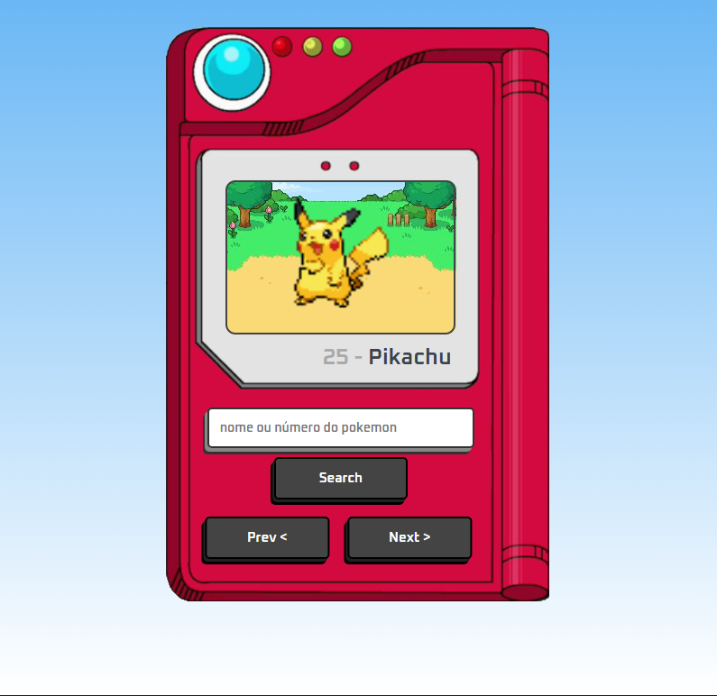

# Pokédex

Projeto de uma Pokédex desenvolvida com HTML, CSS e JavaScript, utilizando a [PokéAPI](https://pokeapi.co/api/v2/pokemon/) para buscar e exibir informações dos Pokémons.

## 🔍 Funcionalidades

- Busca de Pokémons por nome ou ID  
- Exibição de imagem, nome, tipo e outras informações básicas  
- Interface simples e responsiva  

## 🛠️ Tecnologias usadas

- HTML  
- CSS  
- JavaScript  
- [PokéAPI](https://pokeapi.co)

## 📷 Preview

## 🚀 Como usar

acesse o link e seja feliz: 
  https://otaviogaldino.github.io/pokedex/
